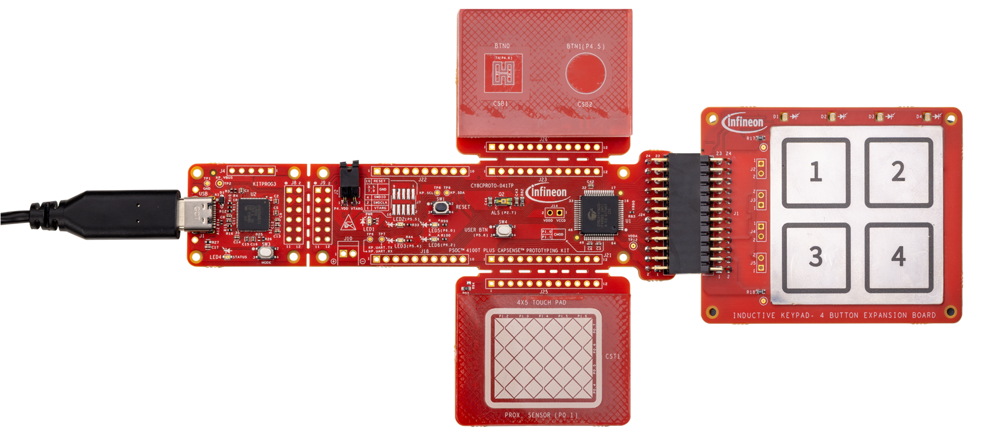

# PSOC&trade; 4: MSCLP capacitive and inductive sensing buttons

This code example demonstrates the implementation of inductive sensing based touch-over-metal (ToM) keypad buttons using SmartSense along with a CSD button and a CSX button on a PSOC&trade; 4 device featuring fifth-generation CAPSENSE&trade; multi-sense converter low power (MSCLP) technology. 

The example showcases methods to configure and scan both inductive and capacitive sensing based buttons together, and uses the CAPSENSE&trade; MSCLP to demonstrate different considerations to implement such a design.

[View this README on GitHub.](https://github.com/Infineon/mtb-example-psoc4-msclp-csd-csx-isx-buttons)

[Provide feedback on this code example.](https://cypress.co1.qualtrics.com/jfe/form/SV_1NTns53sK2yiljn?Q_EED=eyJVbmlxdWUgRG9jIElkIjoiQ0UyNDEzNjYiLCJTcGVjIE51bWJlciI6IjAwMi00MTM2NiIsIkRvYyBUaXRsZSI6IlBTT0MmdHJhZGU7IDQ6IE1TQ0xQIGNhcGFjaXRpdmUgYW5kIGluZHVjdGl2ZSBzZW5zaW5nIGJ1dHRvbnMiLCJyaWQiOiJqYWluc2lkaGFydGgiLCJEb2MgdmVyc2lvbiI6IjEuMC4wIiwiRG9jIExhbmd1YWdlIjoiRW5nbGlzaCIsIkRvYyBEaXZpc2lvbiI6Ik1DRCIsIkRvYyBCVSI6IklDVyIsIkRvYyBGYW1pbHkiOiJQU09DIn0=)


## Requirements

- [ModusToolbox&trade;](https://www.infineon.com/modustoolbox) v3.5 or later

   > **Note:** This code example version requires ModusToolbox&trade; v3.5 and is not backward compatible with v3.4 or older versions.

- Board support package (BSP) minimum required version: 3.3.0
- Programming language: C
- Associated parts: [PSOC&trade; 4100T Plus](https://www.infineon.com/002-39671)


## Supported toolchains (make variable 'TOOLCHAIN')

- GNU Arm&reg; Embedded Compiler v11.3.1 (`GCC_ARM`) – Default value of `TOOLCHAIN`
- Arm&reg; Compiler v6.22 (`ARM`)
- IAR C/C++ Compiler v9.50.2 (`IAR`)


## Supported kits (make variable 'TARGET')

- [PSOC&trade; 4100T Plus CAPSENSE&trade; Prototyping Kit](https://www.infineon.com/CY8CPROTO-041TP) (`CY8CPROTO-041TP`) - Default `TARGET`


## Hardware setup

This example uses the board's default configuration. See the kit user guide [CY8CPROTO-041TP PSOC&trade; 4100T Plus CAPSENSE&trade; Prototyping Kit guide](https://www.infineon.com/002-40273) to configure the required operating voltage and to setup the VDDA supply voltage, see Section [Set up the VDDA supply voltage and debug mode in Device Configurator](#set-up-the-vdda-supply-voltage-and-debug-mode-in-device-configurator).

This application is tuned to perform optimally at the default voltage. However, you can observe the basic functionality at other supported voltages.


## Software setup

See the [ModusToolbox&trade; tools package installation guide](https://www.infineon.com/ModusToolboxInstallguide) for information about installing and configuring the tools package.

## Using the code example


### Create the project

The ModusToolbox&trade; tools package provides the Project Creator as both a GUI tool and a command line tool.

<details><summary><b>Use Project Creator GUI</b></summary>

1. Open the Project Creator GUI tool

   There are several ways to do this, including launching it from the dashboard or from inside the Eclipse IDE. For more details, see the [Project Creator user guide](https://www.infineon.com/ModusToolboxProjectCreator) (locally available at *{ModusToolbox&trade; install directory}/tools_{version}/project-creator/docs/project-creator.pdf*)

2. On the **Choose Board Support Package (BSP)** page, select a kit supported by this code example. See [Supported kits](#supported-kits-make-variable-target)

   > **Note:** To use this code example for a kit not listed here, you may need to update the source files. If the kit does not have the required resources, the application may not work

3. On the **Select Application** page:

   a. Select the **Applications(s) Root Path** and the **Target IDE**

      > **Note:** Depending on how you open the Project Creator tool, these fields may be pre-selected for you

   b. Select this code example from the list by enabling its check box

      > **Note:** You can narrow the list of displayed examples by typing in the filter box

   c. (Optional) Change the suggested **New Application Name** and **New BSP Name**

   d. Click **Create** to complete the application creation process

</details>


<details><summary><b>Use Project Creator CLI</b></summary>

The 'project-creator-cli' tool can be used to create applications from a CLI terminal or from within batch files or shell scripts. This tool is available in the *{ModusToolbox&trade; install directory}/tools_{version}/project-creator/* directory.

Use a CLI terminal to invoke the 'project-creator-cli' tool. On Windows, use the command-line 'modus-shell' program provided in the ModusToolbox&trade; installation instead of a standard Windows command-line application. This shell provides access to all ModusToolbox&trade; tools. You can access it by typing "modus-shell" in the search box in the Windows menu. In Linux and macOS, you can use any terminal application.

The following example clones the "[mtb-example-psoc4-msclp-csd-csx-isx-buttons](https://github.com/Infineon/mtb-example-psoc4-msclp-csd-csx-isx-buttons)" application with the desired name "MSCLP_ISX_Buttons" configured for the *CY8CPROTO-041TP* BSP into the specified working directory, *C:/mtb_projects*:

   ```
   project-creator-cli --board-id CY8CPROTO-041TP --app-id mtb-example-psoc4-msclp-csd-csx-isx-buttons --user-app-name MSCLP_ISX_Buttons --target-dir "C:/mtb_projects"
   ```

The 'project-creator-cli' tool has the following arguments:

Argument | Description | Required/optional
---------|-------------|-----------
`--board-id` | Defined in the <id> field of the [BSP](https://github.com/Infineon?q=bsp-manifest&type=&language=&sort=) manifest | Required
`--app-id`   | Defined in the <id> field of the [CE](https://github.com/Infineon?q=ce-manifest&type=&language=&sort=) manifest | Required
`--target-dir`| Specify the directory in which the application is to be created if you prefer not to use the default current working directory | Optional
`--user-app-name`| Specify the name of the application if you prefer to have a name other than the example's default name | Optional

<br>

> **Note:** The project-creator-cli tool uses the `git clone` and `make getlibs` commands to fetch the repository and import the required libraries. For details, see the "Project creator tools" section of the [ModusToolbox&trade; tools package user guide](https://www.infineon.com/ModusToolboxUserGuide) (locally available at {ModusToolbox&trade; install directory}/docs_{version}/mtb_user_guide.pdf).

</details>


### Open the project

After the project has been created, you can open it in your preferred development environment.


<details><summary><b>Eclipse IDE</b></summary>

If you opened the Project Creator tool from the included Eclipse IDE, the project will open in Eclipse automatically.

For more details, see the [Eclipse IDE for ModusToolbox&trade; user guide](https://www.infineon.com/MTBEclipseIDEUserGuide) (locally available at *{ModusToolbox&trade; install directory}/docs_{version}/mt_ide_user_guide.pdf*).

</details>


<details><summary><b>Visual Studio (VS) Code</b></summary>

Launch VS Code manually, and then open the generated *{project-name}.code-workspace* file located in the project directory.

For more details, see the [Visual Studio Code for ModusToolbox&trade; user guide](https://www.infineon.com/MTBVSCodeUserGuide) (locally available at *{ModusToolbox&trade; install directory}/docs_{version}/mt_vscode_user_guide.pdf*).

</details>


<details><summary><b>Arm&reg; Keil&reg; µVision&reg;</b></summary>

Double-click the generated *{project-name}.cprj* file to launch the Keil&reg; µVision&reg; IDE.

For more details, see the [Arm&reg; Keil&reg; µVision&reg; for ModusToolbox&trade; user guide](https://www.infineon.com/MTBuVisionUserGuide) (locally available at *{ModusToolbox&trade; install directory}/docs_{version}/mt_uvision_user_guide.pdf*).

</details>


<details><summary><b>IAR Embedded Workbench</b></summary>

Open IAR Embedded Workbench manually, and create a new project. Then select the generated *{project-name}.ipcf* file located in the project directory.

For more details, see the [IAR Embedded Workbench for ModusToolbox&trade; user guide](https://www.infineon.com/MTBIARUserGuide) (locally available at *{ModusToolbox&trade; install directory}/docs_{version}/mt_iar_user_guide.pdf*).

</details>


<details><summary><b>Command line</b></summary>

If you prefer to use the CLI, open the appropriate terminal, and navigate to the project directory. On Windows, use the command-line 'modus-shell' program; on Linux and macOS, you can use any terminal application. From there, you can run various `make` commands.

For more details, see the [ModusToolbox&trade; tools package user guide](https://www.infineon.com/ModusToolboxUserGuide) (locally available at *{ModusToolbox&trade; install directory}/docs_{version}/mtb_user_guide.pdf*).

</details>


## Operation

1. Connect the USB cable between the [CY8CPROTO-041TP kit](https://www.infineon.com/CY8CPROTO-041TP) and the PC with the keypad-4 extension board as shown in **Figure 1**

   **Figure 1. Connecting the CY8CPROTO-041TP kit with the USB cable**

   

2. Program the board using one of the following:

   <details><summary><b>Using Eclipse IDE</b></summary>

      1. Select the application project in the Project Explorer

      2. In the **Quick Panel**, scroll down, and click **\<Application Name> Program (KitProg3_MiniProg4)**
   </details>


   <details><summary><b>In other IDEs</b></summary>

   Follow the instructions in your preferred IDE.

   </details>


   <details><summary><b>Using CLI</b></summary>

     From the terminal, execute the `make program` command to build and program the application using the default toolchain to the default target. The default toolchain is specified in the application's Makefile but you can override this value manually:
      ```
      make program TOOLCHAIN=<toolchain>
      ```

      Example:
      ```
      make program TOOLCHAIN=GCC_ARM
      ```
   </details>

3. After programming, the application starts automatically

4. Press any of the inductive sensors or the CSD or CSX buttons with your finger; LEDs turn ON, indicating the activation of the corresponding sensors as shown in **Figure 2**

   **Figure 2. Press the CY8CPROTO-041TP kit with the PC**

   

   **Table 1. LED states for different sensors**

   Sensor | LED indication
   :---------------------| :-----
   ISX button 1  | LED D1 turns ON
   ISX button 2  | LED D2 turns ON
   ISX button 3  | LED D3 and LED6 turn ON (see note below)
   ISX button 4  | LED D4 turns ON
   CSD button    | LED 3 turns ON
   CSX button    | LED 2 turns ON
   
   <br>

   All LEDs will be OFF when none of the sensor buttons are pressed.
   
   > **Note:** When pressing ISX button 3, the LED D3 on the expansion board and LED6 on the control board will both turn ON because they share the same GPIO pin.


### Monitor data using CAPSENSE&trade; Tuner

1. Open the CAPSENSE&trade; Tuner from the **Tools** section in the IDE Quick Panel

   You can also run the CAPSENSE&trade; Tuner application standalone from *{ModusToolbox&trade; install directory}/ModusToolbox/tools_{version}/capsense-configurator/capsense-tuner*. In this case, after opening the application, select **File** > **Open** and open the *design.cycapsense* file of the respective application, which is located in the *{Application root directory}/bsps/TARGET_APP_\<BSP-NAME>/config* folder

   See the [ModusToolbox&trade; user guide](https://www.infineon.com/ModusToolboxUserGuide) (locally available at *{ModusToolbox install directory}/docs_{version}/mtb_user_guide.pdf*) for options to open the CAPSENSE&trade; Tuner application using the CLI

2. Ensure that the status LED is ON and not blinking; as it indicates that the onboard KitProg3 is in CMSIS-DAP Bulk mode. See the [Firmware-loader](https://github.com/Infineon/Firmware-loader) to learn how to update the firmware and switch modes in KitProg3

3. In the tuner application, click on the **Tuner Communication Setup** icon or select **Tools** > **Tuner Communication Setup** as shown in **Figure 3**

   **Figure 3. Tuner communication setup**

    

   Select I2C under KitProg3 and configure it as follows:

   - **I2C address:** 8
   - **Sub-address:** 2-Bytes
   - **Speed (kHz):** 400

   These are the same values set in the EZI2C resource as shown in **Figure 4**

   **Figure 4. Tuner Communication Setup parameters**

   

4. Click **Connect** or select **Communication** > **Connect** to establish a connection

   **Figure 5. Establish connection**

   

5. Click **Start** or select **Communication** > **Start** to begin data streaming from the device

   **Figure 6. Start Tuner communication**

   

   The **Widget/Sensor Parameters** tab is updated with the parameters configured in the **CAPSENSE&trade; Configurator** window. The tuner displays the data from the sensor in the **Widget View** and **Graph View** tabs

6. Set the **Read mode** to **Synchronized mode**. Navigate to the **Widget view** tab and notice that the pressed widget is highlighted in **blue** as shown in **Figure 7**. The CAPSENSE&trade; buttons are tuned to respond to a light finger touch. The ISX buttons are tuned to respond to a finger press with a 3N force

   **Figure 7. Widget view of the CAPSENSE&trade; Tuner**

   

7. Go to the **Graph View** tab to view the raw count, baseline, difference count, and status of each sensor. To view the sensor data for the different ISX buttons, select ISX_Button1_Rx0_Lx0 under ISX_Button1 and so on, respectively (see **Figure 8**). Similarly for the CAPSENSE&trade; buttons, select the CSD_Button_Sns0 under CSD_Button and so forth.

   **Figure 8. Graph view of the CAPSENSE&trade; Tuner for the ISX button**

   

8. Switch to the **SNR Measurement** tab for measuring the signal-to-noise ratio (SNR) and verify that the SNR is greater than 10:1, and the signal count is above 50; select the **ISX_Button1** widget and **ISX_Button1_Rx0_Lx0** sensor, and then click **Acquire noise** as shown in **Figure 9**

   **Figure 9. CAPSENSE&trade; Tuner - SNR measurement: Acquire noise**

   
    
   <br>

9. Once the noise is acquired, press the finger at the required position on the button and click **Acquire signal**. Ensure that the finger remains on the button as long as the signal acquisition is in progress. Observe that the SNR is greater than 10:1 and the signal count is above '50'

   The calculated SNR on this button is displayed as shown in **Figure 10**. Based on the end system design, test the signal with a finger press force that matches the size and pressure of a normal use case. Also, test using lighter presses that will be rejected by the system to ensure that they do not reach the finger threshold. Use a force meter to apply the required force
   
   **Figure 10. CAPSENSE&trade; Tuner - SNR measurement: Acquire signal**

   
   
   <br>

   **Table 2. SNR values for the regular widgets for the keypad-4 board**

   Sensor | SNR for 3N force / 6 mm button press as applicable
   :---------------------| :-----
   ISX_Button1  | 42
   ISX_Button2  | 16
   ISX_Button3  | 51
   ISX_Button4  | 66
   CSD_Button   | 5.8
   CSX_Button   | 7.7
   
   <br>
   
   > **Note:** For the CAPSENSE&trade; buttons, a metal finger of 6 mm diameter has been used for tuning


### Scanning ISX, CSD, and CSX sensors

As per CAPSENSE&trade; middleware errata [17158](https://infineon.github.io/capsense/capsense_api_reference_manual/html/index.html#section_capsense_errata), the ISX scan followed by BIST measurement or with other sensing methods CSD and CSX introduces a drift in raw count, which impacts the performance and accuracy of the ISX scanning.

These are the possible workarounds:

1. Use ISX in stand-alone mode without other sensing methods. The code example uses the `Cy_CapSense_ScanSlots()` API to do this. The ISX sensors are scanned separately from the CSD and CSX sensors

   ```
   /*Scan all slots corresponding to the ISX buttons*/
   Cy_CapSense_ScanSlots(0u,4u,&cy_capsense_context);
   while(Cy_CapSense_IsBusy(&cy_capsense_context)){}

   /*Scan the slots corresponding to the CSD button*/
   Cy_CapSense_ScanSlots(4u,1u,&cy_capsense_context);
   while(Cy_CapSense_IsBusy(&cy_capsense_context)){}

   /*Scan the slots corresponding to the CSX button*/
   Cy_CapSense_ScanSlots(5u,1u,&cy_capsense_context);
   while(Cy_CapSense_IsBusy(&cy_capsense_context)){}
   ```

2. Use ISX without built-in self-test (BIST) as done in this example

3. Configure the inactive sensor connection parameter to High-Z for the ISX scanning. This is the default configuration when the ISX sensors are scanned

4. Introduce a dummy scan before ISX. This can be done by increasing the number of init sub-conversions via the CAPSENSE&trade; Configurator as shown in **Figure 11**

   **Figure 11. Increasing init sub-conversions via CAPSENSE&trade; Configurator**

   


### Tuning procedure

<details><summary><b>Create a custom BSP for your board</b></summary>

1. Create a custom BSP for your board having any device, by following the steps given in the [ModusToolbox&trade; BSP Assistant user guide](https://www.infineon.com/ModusToolboxBSPAssistant)

2. Open the *design.modus* file from *{Application root directory}/bsps/TARGET_APP_\<BSP-NAME>/config* folder obtained in the previous step and enable CAPSENSE&trade; to get the *design.cycapsense* file. CAPSENSE&trade; configuration can then be started from scratch as follows:
</details>

<br>

> **Note:** See the "Tuning the inductive-sensing solution" section in the [AN239751 – Flyback inductive sensing (ISX) design guide](https://www.infineon.com/AN239751) and the "Selecting CAPSENSE&trade; hardware parameters" section in [AN85951 – PSOC&trade; 4 and PSOC&trade; 6 CAPSENSE&trade; design guide](https://www.infineon.com/AN85951) to learn about the considerations for selecting each parameter value.

See the following code examples to learn more about the tuning flow for the different widgets:

- [PSOC&trade; 4: MSCLP inductive sensing touch-over-metal keypad-4 demo](https://github.com/Infineon/mtb-example-msclp-isx-tom-keypad-4-buttons-demo)
- [PSOC&trade; 4: MSCLP low-power self-capacitance button](https://github.com/Infineon/mtb-example-psoc4-msclp-low-power-csd-button)
- [PSOC&trade; 4: MSCLP low-power mutual-capacitance button](https://github.com/Infineon/mtb-example-psoc4-msclp-low-power-csx-button)

## Operation at other voltages

[CY8CPROTO-041TP kit](https://www.infineon.com/CY8CPROTO-041TP) supports operating voltages of 1.8 V, 3.3 V, and 5 V. See the [kit user guide](https://www.infineon.com/002-40273) to set the preferred operating voltage and see section [Setup the VDDA supply voltage and debug mode in Device Configurator](#set-up-the-vdda-supply-voltage-and-debug-mode-in-device-configurator).

The functionalities of this application is optimally tuned for 5 V, which is the default operating voltage for this kit. Observe that the basic functionalities work across other voltages.

For optimal performance, it is recommended to repeat the tuning procedure if the operating voltage is changed from default.

# Debugging

You can debug this project to step through the code. In the IDE, use the **\<Application Name> Debug (KitProg3_MiniProg4)** configuration in the **Quick Panel**. For details, see the "Program and debug" section in the [Eclipse IDE for ModusToolbox&trade; user guide](https://www.infineon.com/MTBEclipseIDEUserGuide).

## Design and implementation

The design has an implementation of the following sensors:
- Four inductive sensing based button widgets (4 elements)
- One self-capacitance based button configured as a regular widget (called "Button" in the CAPSENSE&trade; Configurator) in the CSD-RM sensing mode
- One mutual-capacitance based button configured as a regular widget (called "Button" in the CAPSENSE&trade; Configurator) in the CSX-RM sensing mode

Following are the six LEDs used in this project: 
- LEDs D0 to D3 show the ISX buttons' touch status. They are turned ON when the corresponding button is pressed and turned OFF when the finger is lifted.
- LED 3 shows the CSD button touch status. It is turned ON when the CSD button is touched and turned OFF when the finger is lifted.
- LED 2 shows the CSX button touch status. It is turned ON when the CSX button is touched and turned OFF when the finger is lifted.

The project uses the [CAPSENSE&trade; middleware](https://github.com/Infineon/capsense) (see [ModusToolbox&trade; user guide](https://www.infineon.com/MTBEclipseIDEUserguide) for more details on selecting a middleware). See [AN85951 – PSOC&trade; 4 and PSOC&trade; 6 MCU CAPSENSE&trade; design guide](https://www.infineon.com/AN85951) and [AN239751 - Flyback inductive sensing (ISX) design guide](https://www.infineon.com/AN239751) for more details on CAPSENSE&trade; features and usage.

The [ModusToolbox&trade;](https://www.infineon.com/modustoolbox) provides a GUI-based tuner application for debugging and tuning the CAPSENSE&trade; system. The CAPSENSE&trade; Tuner application works with EZI2C and UART communication interfaces. This project has a Serial Communication Block (SCB) configured in EZI2C mode to establish communication with the onboard KitProg, which in turn enables reading the CAPSENSE&trade; raw data using the CAPSENSE&trade; Tuner. See **Figure 13** in [Resources and settings](#resources-and-settings) section for the EZI2C settings used in this code example.

The CAPSENSE&trade; data structure that contains the CAPSENSE&trade; raw data is exposed to the CAPSENSE&trade; Tuner by setting up the I2C communication data buffer with the CAPSENSE&trade; data structure. This enables the tuner to access the CAPSENSE&trade; raw data for tuning and debugging CAPSENSE&trade;.


### Set up the VDDA supply voltage and Debug mode in Device Configurator

1. Open **Device Configurator** from the Quick Panel

2. Go to the **System** tab, select the **Power** resource, and set the VDDA value under **Operating conditions** as shown in **Figure 12**

   **Figure 12. Setting the VDDA supply in System tab of Device Configurator**

   


## Resources and settings

**Figure 13. EZI2C settings**


<br>

**Table 3. Application resources**

Resource  |  Alias/object     |    Purpose
:-------- | :-------------    | :------------
SCB (I2C) (PDL) | CYBSP_EZI2C          | EZI2C slave driver to communicate with CAPSENSE&trade; Tuner
CAPSENSE&trade; | CYBSP_MSC | CAPSENSE&trade; driver to interact with the MSC hardware and interface the CAPSENSE&trade; sensors

<br>

### Firmware flow

**Figure 13. Firmware flowchart**


## Related resources

Resources  | Links
-----------|----------------------------------
Application notes  | [AN79953](https://www.infineon.com/AN79953) – Getting started with PSOC&trade; 4 MCU <br>  [AN234231](https://www.infineon.com/AN234231) – PSOC&trade; 4 CAPSENSE&trade; ultra-low-power capacitive sensing techniques <br> [AN85951](https://www.infineon.com/AN85951) – PSOC&trade; 4 and PSOC&trade; 6 MCU CAPSENSE&trade; design guide <br>  [AN239751](https://www.infineon.com/AN239751) – Flyback inductive sensing (ISX) design guide
Code examples  | [Using ModusToolbox&trade;](https://github.com/Infineon/Code-Examples-for-ModusToolbox-Software) on GitHub
Device documentation |  [PSOC&trade; 4 datasheets](https://www.infineon.com/cms/en/search.html?intc=searchkwr-return#!view=downloads&term=psoc%204&doc_group=Data%20Sheet) <br>[PSOC&trade; 4 technical reference manuals](https://www.infineon.com/cms/en/search.html#!term=psoc%204%20technical%20reference%20manual&view=all)
Development kits | Select your kits from the [Evaluation board finder](https://www.infineon.com/cms/en/design-support/finder-selection-tools/product-finder/evaluation-board)
Libraries on GitHub  | [mtb-pdl-cat2](https://github.com/Infineon/mtb-pdl-cat2) –  PSOC&trade; 4 Peripheral Driver Library (PDL) <br> [mtb-hal-cat2](https://github.com/Infineon/mtb-hal-cat2) – Hardware Abstraction Layer (HAL) library
Middleware on GitHub  | [capsense](https://github.com/Infineon/capsense) – CAPSENSE&trade; library and documents
Tools  | [ModusToolbox&trade;](https://www.infineon.com/modustoolbox) – ModusToolbox&trade; software is a collection of easy-to-use libraries and tools enabling rapid development with Infineon MCUs for applications ranging from wireless and cloud-connected systems, edge AI/ML, embedded sense and control, to wired USB connectivity using PSOC&trade; Industrial/IoT MCUs, AIROC&trade; Wi-Fi and Bluetooth&reg; connectivity devices, XMC&trade; Industrial MCUs, and EZ-USB&trade;/EZ-PD&trade; wired connectivity controllers. ModusToolbox&trade; incorporates a comprehensive set of BSPs, HAL, libraries, configuration tools, and provides support for industry-standard IDEs to fast-track your embedded application development

<br>


## Other resources

Infineon provides a wealth of data at [www.infineon.com](https://www.infineon.com) to help you select the right device, and quickly and effectively integrate it into your design.


## Document history

Document title: *CE241366* – *PSOC&trade; 4: MSCLP capacitive and inductive sensing buttons*

 Version | Description of change
 ------- | ---------------------
 1.0.0   | New code example
<br>


All referenced product or service names and trademarks are the property of their respective owners.

The Bluetooth&reg; word mark and logos are registered trademarks owned by Bluetooth SIG, Inc., and any use of such marks by Infineon is under license.

PSOC&trade;, formerly known as PSoC&trade;, is a trademark of Infineon Technologies. Any references to PSoC&trade; in this document or others shall be deemed to refer to PSOC&trade;.

---------------------------------------------------------

© Cypress Semiconductor Corporation, 2025. This document is the property of Cypress Semiconductor Corporation, an Infineon Technologies company, and its affiliates ("Cypress").  This document, including any software or firmware included or referenced in this document ("Software"), is owned by Cypress under the intellectual property laws and treaties of the United States and other countries worldwide.  Cypress reserves all rights under such laws and treaties and does not, except as specifically stated in this paragraph, grant any license under its patents, copyrights, trademarks, or other intellectual property rights.  If the Software is not accompanied by a license agreement and you do not otherwise have a written agreement with Cypress governing the use of the Software, then Cypress hereby grants you a personal, non-exclusive, nontransferable license (without the right to sublicense) (1) under its copyright rights in the Software (a) for Software provided in source code form, to modify and reproduce the Software solely for use with Cypress hardware products, only internally within your organization, and (b) to distribute the Software in binary code form externally to end users (either directly or indirectly through resellers and distributors), solely for use on Cypress hardware product units, and (2) under those claims of Cypress's patents that are infringed by the Software (as provided by Cypress, unmodified) to make, use, distribute, and import the Software solely for use with Cypress hardware products.  Any other use, reproduction, modification, translation, or compilation of the Software is prohibited.
<br>
TO THE EXTENT PERMITTED BY APPLICABLE LAW, CYPRESS MAKES NO WARRANTY OF ANY KIND, EXPRESS OR IMPLIED, WITH REGARD TO THIS DOCUMENT OR ANY SOFTWARE OR ACCOMPANYING HARDWARE, INCLUDING, BUT NOT LIMITED TO, THE IMPLIED WARRANTIES OF MERCHANTABILITY AND FITNESS FOR A PARTICULAR PURPOSE.  No computing device can be absolutely secure.  Therefore, despite security measures implemented in Cypress hardware or software products, Cypress shall have no liability arising out of any security breach, such as unauthorized access to or use of a Cypress product. CYPRESS DOES NOT REPRESENT, WARRANT, OR GUARANTEE THAT CYPRESS PRODUCTS, OR SYSTEMS CREATED USING CYPRESS PRODUCTS, WILL BE FREE FROM CORRUPTION, ATTACK, VIRUSES, INTERFERENCE, HACKING, DATA LOSS OR THEFT, OR OTHER SECURITY INTRUSION (collectively, "Security Breach").  Cypress disclaims any liability relating to any Security Breach, and you shall and hereby do release Cypress from any claim, damage, or other liability arising from any Security Breach.  In addition, the products described in these materials may contain design defects or errors known as errata which may cause the product to deviate from published specifications. To the extent permitted by applicable law, Cypress reserves the right to make changes to this document without further notice. Cypress does not assume any liability arising out of the application or use of any product or circuit described in this document. Any information provided in this document, including any sample design information or programming code, is provided only for reference purposes.  It is the responsibility of the user of this document to properly design, program, and test the functionality and safety of any application made of this information and any resulting product.  "High-Risk Device" means any device or system whose failure could cause personal injury, death, or property damage.  Examples of High-Risk Devices are weapons, nuclear installations, surgical implants, and other medical devices.  "Critical Component" means any component of a High-Risk Device whose failure to perform can be reasonably expected to cause, directly or indirectly, the failure of the High-Risk Device, or to affect its safety or effectiveness.  Cypress is not liable, in whole or in part, and you shall and hereby do release Cypress from any claim, damage, or other liability arising from any use of a Cypress product as a Critical Component in a High-Risk Device. You shall indemnify and hold Cypress, including its affiliates, and its directors, officers, employees, agents, distributors, and assigns harmless from and against all claims, costs, damages, and expenses, arising out of any claim, including claims for product liability, personal injury or death, or property damage arising from any use of a Cypress product as a Critical Component in a High-Risk Device. Cypress products are not intended or authorized for use as a Critical Component in any High-Risk Device except to the limited extent that (i) Cypress's published data sheet for the product explicitly states Cypress has qualified the product for use in a specific High-Risk Device, or (ii) Cypress has given you advance written authorization to use the product as a Critical Component in the specific High-Risk Device and you have signed a separate indemnification agreement.
<br>
Cypress, the Cypress logo, and combinations thereof, ModusToolbox, PSoC, CAPSENSE, EZ-USB, F-RAM, and TRAVEO are trademarks or registered trademarks of Cypress or a subsidiary of Cypress in the United States or in other countries. For a more complete list of Cypress trademarks, visit www.infineon.com. Other names and brands may be claimed as property of their respective owners.